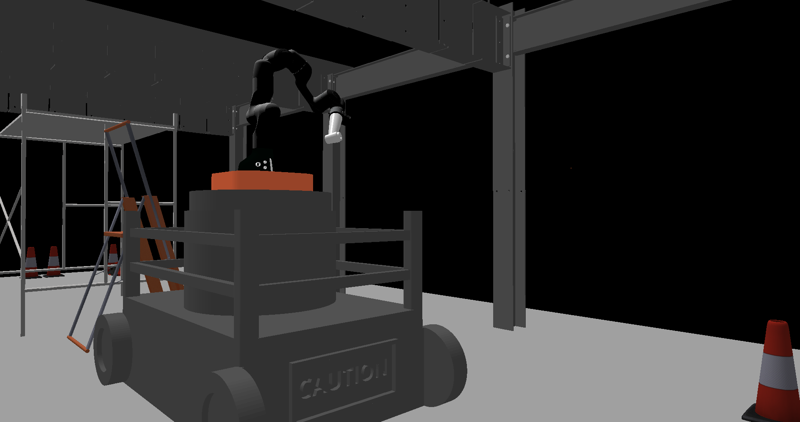

# construction-robotics

This repository was built from templates found in [sai2-examples](https://github.com/manips-sai-org/sai2-examples)

construction-robotics depends on [sai2-interfaces](https://github.com/manips-sai-org/sai2-interfaces), chai3d, sai2-common, sai2-graphics, sai2-model, sai2-primitives, sai2-simulation, and sai2-urdfreader.



To build the examples:
```
mkdir build && cd build
cmake ..
make
```

Binaries will placed in the `bin/` folder.

To fully start the bolting demo, you can use the launch script provided:
```
cd bin/construction
./launch.sh
```
To fully start the gui, you can use the launch script provided:
```
cd bin/gui-construction
./launch_gui.sh
```
After that's all done, navigate to `localhost:8000` to interact with the gui.
